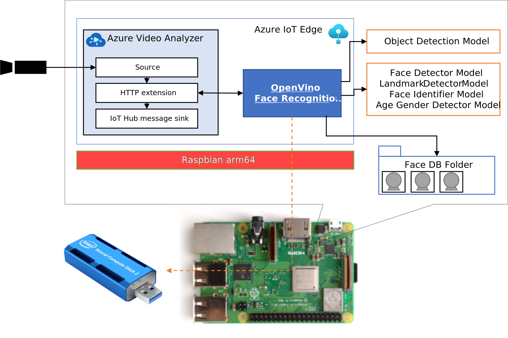

# Openvino Face Recognition with Azure Video Analyzer on Edge  
OpenVino Face Recognition modle is wrapper of openvino toolkit with Intel Movidius for [Azure Video Analyzer on Edge](https://docs.microsoft.com/azure/azure-video-analyzer/video-analyzer-docs/) on Raspberry Pi.   
In a pipeline of AVA on Edge, you can use following features.  
|Feature|URI|
|-|-|
|Face Recognition|http://<i>ipaddress</i>:8888/facerecognition|
|Object Detection|http://<i>ipaddress</i>:8888/objectdetection|



This sample is based on information published at the following sites.  
- https://docs.openvinotoolkit.org/2021.2/openvino_docs_install_guides_installing_openvino_raspbian.html  
- 
## Build IoT Edge Module ( Docker Image)
### Recommended Build Environment  
|||
|-|-|
|HW|Raspberry Pi 4 8GB Ram|
|OS|Raspbian Arm32v7|

※ You can use Raspberry Pi 3 but you should spend long long time for build. In the case of Raspberry Pi 4 8MB Ram, it takes about 3 hours.  

### Build  
By SSH shell, execute following command
```sh
git clone https://github.com/ms-iotkithol-jp/openvino-face-recognition-with-ava-on-edge.git
cd openvino-face-recognition-with-ava-on-edge/EdgeSolution/modules/openvinofacerecog
sudo docker build -t openvinofacerecog -f Dockerfile.arm32v7
sudo docker tag openvinofacerecog your-docker-hub/openvinofacerecog:version-arm32v7
sudo docker push your-docker-hub/openvinofacerecog:version-arm32v7
```
---
## Run AVA on Edge with OpenVino Face Recognition  
You can use Raspberry Pi 3 Model B or Raspberry Pi 4. <b><u>Installed OS should be Raspbian ARM64</u></b>.   

### Setup deployment of necessary IoT Edge Modules
Please setup AVA on Edge and Blob on Edge according to following Docs site.  
|||
|-|-|
|AVA on Edge|https://docs.microsoft.com/azure/azure-video-analyzer/video-analyzer-docs/deploy-iot-edge-device|
|Blob on Edge|https://docs.microsoft.com/azure/iot-edge/how-to-deploy-blob?view=iotedge-2020-11|

### Setup for OpenVino Face Recognition  
Make directory for Face Identity Database.
```sh
sudo mkdir /facedb
```
Please add several jpeg files of persons who you want to idenfiy according to https://github.com/openvinotoolkit/open_model_zoo/tree/master/demos/face_recognition_demo/python  

### Create gzipped tar file of necessary models  
#### Object Detection  
You can use various AI learned model for this feature.   
Available models are listed at https://github.com/openvinotoolkit/open_model_zoo/tree/master/demos/object_detection_demo/python#supported-models  
For example you'd like to use [yolo-v2-ava-0001](https://github.com/openvinotoolkit/open_model_zoo/tree/master/models/intel/yolo-v2-ava-0001), download the model files and format them into a gzipped tar file on your Raspberry Pi shell.  
```sh
cd ~
mkdir odmodel
git clone https://github.com/openvinotoolkit/open_model_zoo.git
cd open_model_zoo/tools/downloader
python3 -mpip install --user -r ./requirements.in
python3 downloader.py --name yolo-v2-ava-001
cp intel/yolo-v2-ava-0001/FP16/* ~/opmodel
cd ~/opmodel
cp open_model_zoo/data/dateset_classes/voc_20cl.txt
cd opmodel
tar zcvf od-model.taz yolo-v2-ava-001.xml yolo-v2-ava-001.bin voc_20cl.txt
```

#### Face Recognition 
OpenVino Face Recognition logic use following models  
|Usage|Model|
|-|-|
|Face Detection|[face-detection-retail-0004](https://github.com/openvinotoolkit/open_model_zoo/tree/master/models/intel/face-detection-retail-0004)|
|Landmark Regression|[landmarks-regression-retail-0009](https://github.com/openvinotoolkit/open_model_zoo/tree/master/models/intel/landmarks-regression-retail-0009)|
|Face Identification|[face-reidentification-retail-0095](https://github.com/openvinotoolkit/open_model_zoo/tree/master/models/intel/face-reidentification-retail-0095)|
|Age Gender Detection|[age-gender-recognition-retail-0013](https://github.com/openvinotoolkit/open_model_zoo/tree/master/models/intel/age-gender-recognition-retail-0013)|

Download above models and format them into gzipped tar file.  
```sh
cd ~/open_model_zoo/tools/downloader
python3 downloader.py --name face-detection-retail-0004
python3 downloader.py --name landmarks-regression-retail-0009
python3 downloader.py --name face-reidentification-retail-0095
python3 downloader.py --name age-gender-recognition-retail-0013
mkdir ~/frmodel
cp intel/face-detection-retail-0004/FP16/* ~/frmodel
cp intel/landmarks-regression-retail-0009/FP16/* ~/frmodel
cp intel/face-reidentification-retail-0095/FP16/* ~/frmodel
cp intel/age-gender-recognition-retail-0013/FP16/* ~/frmodel
cd ~/frmodel
tar zcvf fr-model.tgz face-detection-retail-0004.* landmarks-regression-retail-0009.* face-reidentification-retail-0095.* age-gender-recognition-retail-0013.*
```

Next create face database for reidentification model. 
1. Prepare images taken from the front of the face for each person in JPEG format and store them into same folder.
1. Create gzipped tar file including the face image files.
```sh
tar zcvf facedb.tgz john.jpg bob.jpg ...
```

After created tgz file, upload it to Azure Blob Container and create URL with SAS Token for downloading by IoT Edge Module.  


## Deploy Module
### Create Options  
```json
{
  "NetworkingConfig": {
    "EndpointsConfig": {
      "host": {}
    }
  },
  "HostConfig": {
    "Binds": [
      "/dev:/dev",
      "/facedb:/facedb"
    ],
    "Privileged": true,
    "PortBindings": {
      "8888/tcp": [
        {
          "HostPort": "8888"
        }
      ]
    },
    "NetworkMode": "host",
    "ExposedPorts": {
      "8888/tcp": {}
    }
  }
}
```

### Module Twins  
```json
{
    "send-telemetry": true,
    "upload": {
        "interval-sec": 70,
        "inference-mark": true
    },
    "model-od": {
        "url": "<- url of object-detection-model.tgz ->",
        "filename": "od-model.tgz",
        "name": "yolo-v2-ava-0001.xml",
        "label": "voc_20cl.txt",
        "architecture-type": "yolo"
    },
    "model-fr": {
        "url": "<- url of face-recognition-related-models.tgz ->",
        "filename": "fr-model.tgz",
        "fd-name": "face-detection-retail-0004.xml",
        "lm-name": "landmarks-regression-retail-0009.xml",
        "reid-name": "face-reidentification-retail-0095.xml",
        "ag-model" : "age-gender-recognition-retail-0013.xml"
    },
    "face-db": {
        "url": "<- url of face-database.tgz ->",
        "filename": "facedb.tgz"
    }
}
```

### Environment Variable 
For the case of Raspberry Pi + INTEL Movidius
|Name|Value|
|-|-|
|BLOB_ON_EDGE_MODULE| name of the deployed 'Blob on Edge' module|
|BLOB_ON_EDGE_ACCOUNT_NAME|local account name specifyed in 'Blob on Edge' module|
|BLOB_ON_EDGE_ACCOUNT_KEY|local account key specifyed in 'Blob on Edge' module|
|BLOB_CONTAINER_NAME|container name specifyed in 'Blob on Edge' module|
|FACEDB_FOLDER_NAME|folder name of face database of face recognition. the folder should be same of create option specified|
|OPENVINO_DEVICE|MYRIAD|
|MSG_OUTPUT_PATH_OD|message output path for object detection. ex) output_od|
|MSG_OUTPUT_PATH_FR|message output path for face recognition. ex) output_fr|
